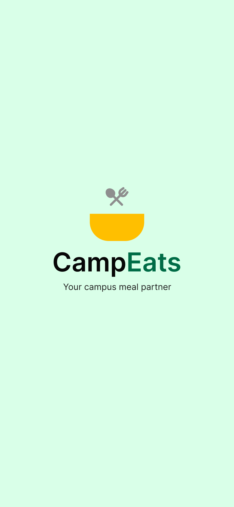
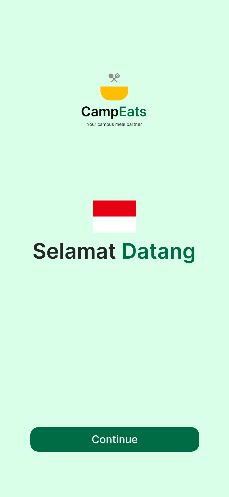
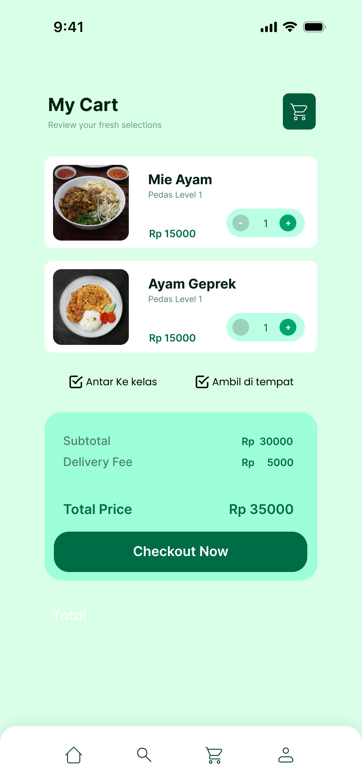
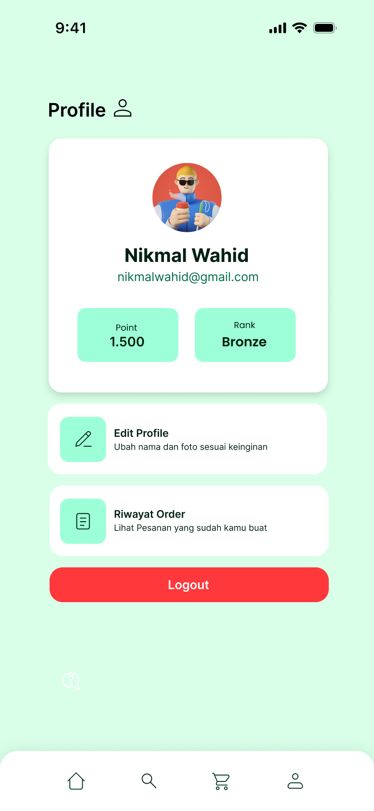
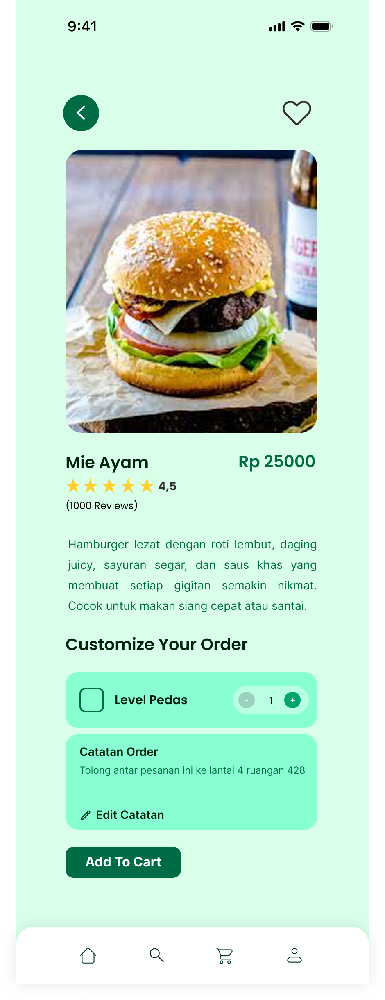
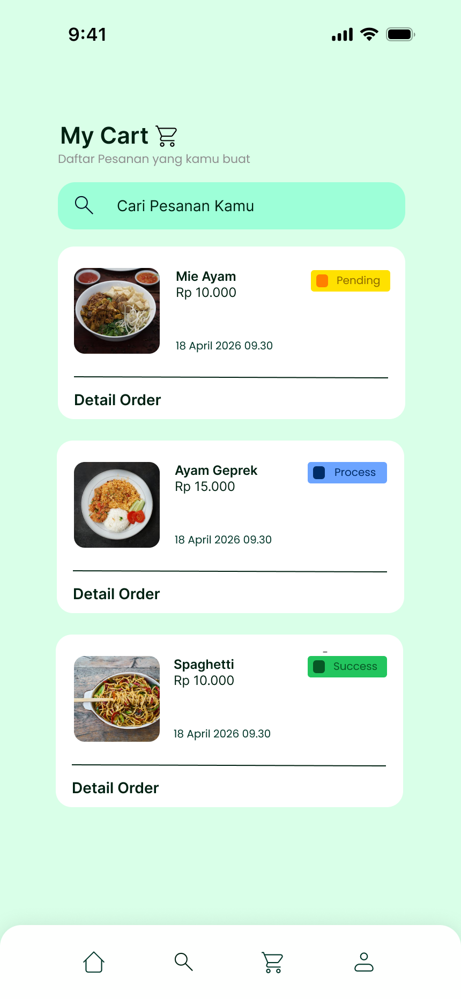
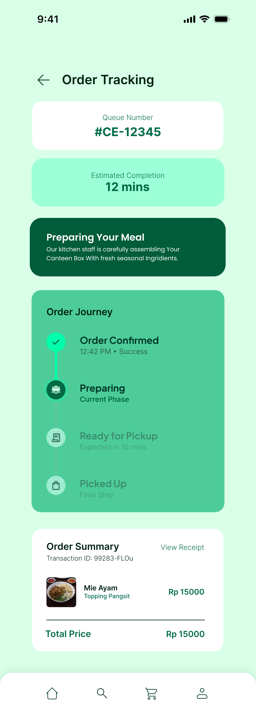
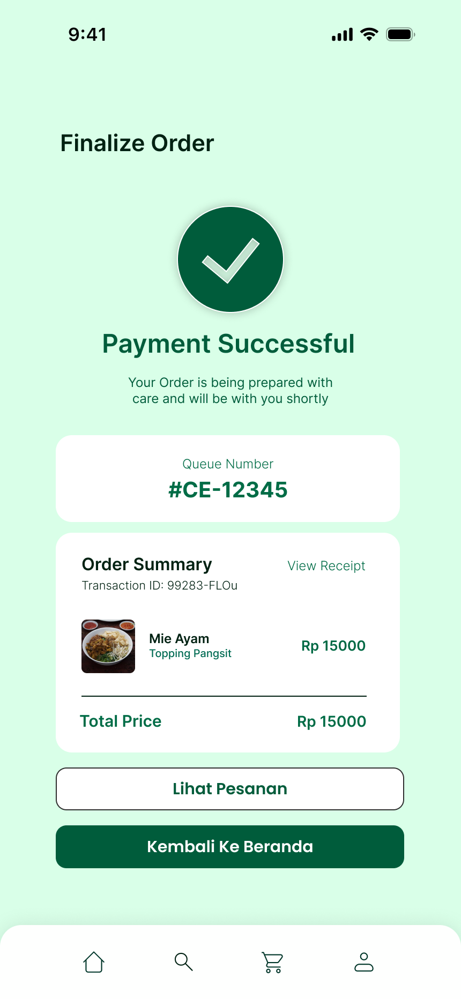

### - Nama: Muhamad Nikmal Wahid
### - Kelas: I241C
### - Nim: 312410372
### - Mata Kuliah: Pemrograman Mobile 2
### - Dosen Pengampu: Donny Maulana, S.Kom., M.M.S.I.,

### Link Video: https://youtu.be/A3Y0fhpCb6o?si=Q-u1eCcjRXdd7olB
### LInk Clickup:  https://sharing.clickup.com/90181799294/l/h/4-90187327418-1/979bc9884f335c5

# 1. Pendahuluan 

## 1.1 Latar Belakang

Perkembangan teknologi mobile telah mendorong digitalisasi berbagai aktivitas sehari-hari, termasuk dalam bidang layanan makanan. Di lingkungan kampus, proses pemesanan makanan masih sering dilakukan secara manual, yang berpotensi menimbulkan antrean, kesalahan pencatatan pesanan, serta kurangnya efisiensi waktu.

Oleh karena itu, dikembangkan aplikasi CampEats, yaitu aplikasi pemesanan makanan kampus berbasis Android yang bertujuan untuk mempermudah mahasiswa dalam menelusuri menu, melakukan pemesanan, serta mengelola transaksi secara digital dan terstruktur.

## 1.2 Rumusan Masalah 

Permasalahan yang diangkat dalam pengembangan aplikasi ini antara lain:
1. Bagaimana merancang aplikasi pemesanan makanan berbasis Android yang mudah digunakan?
2. Bagaimana menerapkan sistem poin sebagai bentuk reward pengguna?

# 1.3 Tujuan Penelitian 
Tujuan dari pengembangan aplikasi CampEats adalah:
- Merancang dan membangun aplikasi pemesanan makanan berbasis Android.
- Meningkatkan pengalaman pengguna melalui antarmuka yang sederhana dan modern.

# 1.4 Manfaat Penelitian 
- Bagi Mahasiswa: Mempermudah proses pemesanan makanan di lingkungan kampus.
- Bagi Pengembang: Sebagai media pembelajaran penerapan Android Development dengan Java.
- Bagi Akademik: Sebagai Studi Kasus Implementasi aplikasi mobile untuk lingkungan kampus.

# 2. Landasan Teori 
## 2.1 Aplikasi Mobile 

Aplikasi mobile merupakan perangkat lunak yang dirancang untuk berjalan pada perangkat bergerak seperti smartphone. Android adalah sistem operasi berbasis Linux yang banyak digunakan karena bersifat open-source dan memiliki ekosistem pengembangan yang luas.

## 2.2 Android SDK dan Java 

Android SDK menyediakan berbagai library dan tools untuk membangun aplikasi Android. Bahasa pemrograman Java digunakan karena stabil, terstruktur, dan didukung penuh oleh Android Studio.

## 2.3 Material Design 

Android SDK menyediakan berbagai library dan tools untuk membangun aplikasi Android. Bahasa pemrograman Java digunakan karena stabil, terstruktur, dan didukung penuh oleh Android Studio.

# 3. Analisis dan Perancangan Sistem 
## 3.1 Analisis Kebutuhan Fungsional 
Aplikasi CampEats memiliki kebutuhan fungsional sebagai berikut:
- Autentikasi pengguna (login dan registrasi)
- Menampilkan daftar menu makanan
- Pencarian menu makanan
- Manajemen keranjang pesanan
- Proses checkout dan perhitungan total harga
- Riwayat transaksi pemesanan
- Sistem poin/reward
- Manajemen profil pengguna dan logout
  
## 3.2 Alur Sistem 

1. Pengguna melakukan login atau registrasi akun.
2. Pengguna mengakses halaman beranda dan melihat daftar menu.
3. Pengguna memilih menu dan menambahkannya ke keranjang.
4. Pengguna melakukan checkout dan memilih metode pembayaran.
5. Sistem menyimpan transaksi dan menambahkan poin reward.

## 3.3 Perancangan Antarmuka 
Antarmuka dirancang menggunakan XML dengan pendekatan:
- Tampilan sederhana dan modern
- Navigasi menggunakan Bottom Navigation
- Konsistensi warna dan komponen Material Design

# 4. Implementasi Sistem 
## 4.1 Teknologi Yang Digunakan 

- Bahasa Pemrograman: Java
- Platform: Android
- UI Design: XML + Material Design
- IDE: Android Studio

## 4.2 Implementasi Fitur Utama 

- RecyclerView digunakan untuk menampilkan daftar menu makanan.
- SharedPreferences digunakan untuk menyimpan data sesi pengguna.
- Bottom Navigation digunakan untuk mempermudah navigasi antar halaman.

## 4.3 Cuplikan Tampilan Aplikasi 

## Mockup Dan Storyboard 

## Cuplikan Tampilan Aplikasi

| Halaman | Preview | Halaman | Preview |
|--------|---------|--------|---------|
| Splash Screen |  | Pilih Bahasa |  |
| Welcome |  | Login |  |
| Register |  | Home |  |
| Search |  | Cart |  |
| Profile |  | Detail Produk |  |
| Keranjang Update |  | Tracking Order |  |
| Final Order |  | Success Order |  |/> |

# 5. Pengujian dan Evaluasi 

Pengujian dilakukan secara fungsional dengan memastikan setiap fitur berjalan sesuai dengan kebutuhan sistem. Berdasarkan hasil pengujian:
- Aplikasi dapat berjalan dengan baik tanpa error utama.
- Seluruh fitur utama dapat digunakan sesuai rancangan.
- Penyimpanan data lokal berjalan dengan stabil.

# 6. Kesimpulan dan Saran 
## 6.1 Kesimpulan
Aplikasi CampEats berhasil dikembangkan sebagai aplikasi pemesanan makanan kampus berbasis Android. Aplikasi ini mampu mengelola menu, transaksi, serta data pengguna secara lokal dengan baik dan memberikan pengalaman pengguna yang cukup optimal.

## 6.2 Saran 
Pengembangan selanjutnya dapat dilakukan dengan:

- Penambahan metode pembayaran digital
- Implementasi notifikasi real-time
- Pengembangan versi multiplatform

